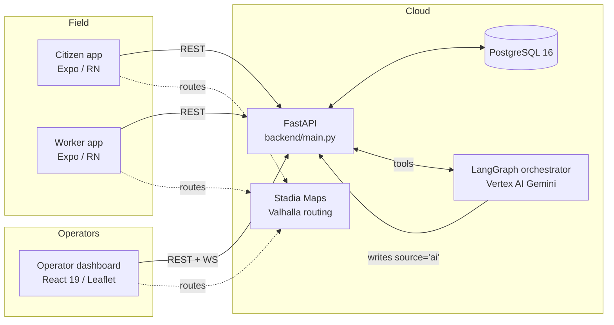
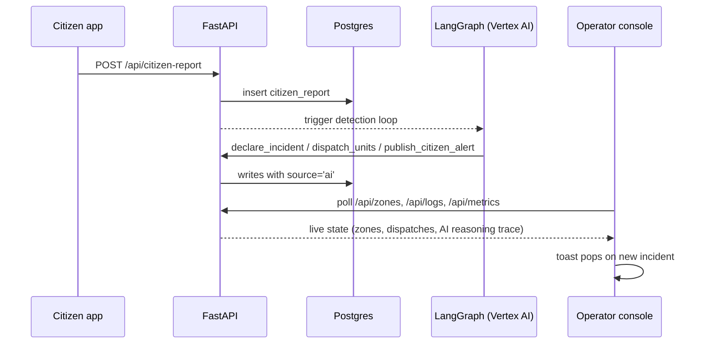

# Sentinel-City

> **Agentic disaster-response platform.** Operators draw zones and trigger events from a web dashboard; an AI orchestrator detects, declares, cordons, and dispatches; citizens and responders see the AI's reasoning and act on it from a mobile app.

```
sentinel-city/
├── backend/    FastAPI + PostgreSQL + LangGraph (Vertex AI Gemini)
├── frontend/   React 19 + Vite + Leaflet operator dashboard (cyber-noir UI)
├── mobile/     Expo SDK 52 + React Native (citizen / worker / admin)
├── db/         Postgres init + numbered migrations
└── docker-compose.yml
```

<!--
  📸 Screenshots
  Drop your screenshots into `docs/screenshots/` and reference them here.
  Suggested shots that show off the new UI:
    - Dashboard hero (full operator console at first load)
    - Command palette (⌘K open with results)
    - AI logs drawer (table view with an expanded row)
    - Weather zones panel (with one zone focused/highlighted)
    - Mobile citizen map (avoid-polygon route in action)
-->

---

## What it does

- **Operator dashboard** ([frontend/](frontend/)) — draw geometry, trigger disasters, watch the AI's log stream, dispatch units manually, manage stations. Cyber-noir glass UI with command palette, keyboard shortcuts, toast notifications, and a context-aware draw toolbar.
- **AI orchestrator** ([backend/orchestrator.py](backend/orchestrator.py)) — two LangGraph ReAct agents on Vertex AI Gemini:
  - *Detection Loop* — ingests citizen reports / weather / traffic, triangulates, declares incidents.
  - *Monitoring Loop* — ranks nearest resources, dispatches fire/EMS/police, cordons no-entry zones, publishes citizen alerts, clears resolved events.
  - Tool surface in [backend/agent_tools.py](backend/agent_tools.py); all writes go through [backend/api_client.py](backend/api_client.py) which stamps `source='ai'` so the mobile app can filter operator vs AI traffic.
- **Mobile app** ([mobile/](mobile/)) — three roles:
  - *Citizen* — AI-warned of nearby hazards, walking routes that avoid them, 911 calling from inside a zone.
  - *Worker* (firefighter / paramedic / police) — driving routes around hazards, dispatch acknowledgment, call queue filtered by service.
  - *Admin* — citywide oversight feed, dispatch + agents + savings telemetry.
- **Backend** ([backend/main.py](backend/main.py)) — system of record. Disasters, citizen reports, responder field reports, 911 calls, fire/hospital/police stations, simulated weather + traffic that react to active events, savings metrics, audit logs.

---

## Architecture



---

## Operator console — UI tour

The dashboard is built around three principles: **map-dominant**, **glass surfaces**, and **keyboard-first**.

| Feature                        | Where                                  | How                                                                       |
| ------------------------------ | -------------------------------------- | ------------------------------------------------------------------------- |
| **Command palette** (⌘K / Ctrl+K) | Centered modal                          | Fuzzy search across disasters, zones, drawers, map style, actions.        |
| **Keyboard shortcuts**         | Global                                  | `?` opens the help overlay; `C` / `A` / `L` toggle drawers; `F` focus mode; `1`–`9` quick-pick disaster type. |
| **System status strip**        | Top of sidebar                          | Live clock, network state, sim readiness, active-incident count.          |
| **Status toasts**              | Top-right of map                        | Auto-pop on incident activation and high-severity 911 calls.              |
| **Context-aware draw toolbar** | Top-left of map                         | Only shows the geometry tools that fit the selected disaster, with a persistent cyan halo and pulsing buttons. |
| **Map legend**                 | Bottom-right of map                     | Collapsible glass panel — explains every symbol (`L` toggles it).         |
| **Weather zones panel**        | Top-right of map                        | Click a numbered badge on the map → panel scrolls to + highlights that zone's stats. |
| **AI logs drawer**             | Centered modal (`A` to open)            | Datadog-style table view: time, event, source/tool, summary. Click any row to expand the full payload. |
| **AI logs filters**            | Inside the AI logs drawer               | Free-text search, event-type select, date-time range with quick presets (5m / 15m / 1h / 24h). |
| **Focus mode** (`F`)           | Hides the sidebar                       | Full-screen map view for active incident management; pill in the corner restores. |

### Keyboard reference

| Key                | Action                              |
| ------------------ | ----------------------------------- |
| `⌘K` / `Ctrl+K`    | Open command palette                |
| `?`                | Open keyboard shortcuts help        |
| `Esc`              | Close topmost overlay               |
| `C`                | Toggle 911 calls drawer             |
| `A`                | Toggle AI logs drawer               |
| `L`                | Toggle map legend                   |
| `F`                | Toggle focus mode (hide sidebar)    |
| `1`–`9`            | Quick-pick disaster type            |

---

## Mobile warnings: AI-only

The mobile app consumes **`GET /api/warnings/nearby?lat=&lng=&radius_m=`** ([backend/main.py:2096](backend/main.py)) — a unified, AI-only nearby-warning feed aggregating five sources, server-filtered to `source='ai'` and proximity-trimmed:

| Source              | AI tool                  | Surfaces as `kind` |
| ------------------- | ------------------------ | ------------------ |
| `notifications`     | `publish_citizen_alert`  | `alert`            |
| `cordons`           | `create_cordon`          | `cordon`           |
| `disaster_events`   | `declare_incident`       | `disaster`         |
| `active_dispatches` | `dispatch_units`         | `dispatch`         |
| weather alerts      | weather watcher          | `weather`          |

Operator-drawn dashboard entries are hidden from mobile. Omitting `lat`/`lng` returns the citywide admin feed.

---

## Citizen-report → operator data flow



---

## Run locally with Docker

```bash
docker compose up --build
# Dashboard → http://localhost:5173
# Backend   → http://localhost:8000  (Swagger at /docs)
# Postgres  → localhost:5432  (sentinel / sentinel)
```

`backend/.env` needs `GOOGLE_CLOUD_PROJECT` + `GOOGLE_CLOUD_LOCATION` for Vertex AI; the service-account JSON mounts from `backend/vertex-sa.json`. See [backend/Dockerfile](backend/Dockerfile) and [docker-compose.yml](docker-compose.yml).

---

## Run pieces individually

### Backend

```bash
cd backend
python3 -m venv venv && source venv/bin/activate      # macOS / Linux
# venv\Scripts\activate                               # Windows
pip install -r requirements.txt
# DATABASE_URL must point at a Postgres (e.g. docker compose up db
# or a Supabase pooler URL)
uvicorn main:app --reload --host 0.0.0.0 --port 8000
```

### Frontend

```bash
cd frontend
cp .env.example .env       # first run only — fill in VITE_STADIA_API_KEY
npm install
npm run dev                # → http://localhost:5173
```

### Mobile

```bash
cd mobile
npm install
# Dev — Metro + Expo Go
npm run start
# Production APK build (see also mobile/eas.json for cloud builds)
npx expo prebuild --platform android
cd android && ./gradlew assembleRelease
# → mobile/android/app/build/outputs/apk/release/app-release.apk
```

Configure backend URL for the APK via `EXPO_PUBLIC_BACKEND_URL`. The current build points at the deployed Cloud Run instance.

### Required env vars

| File                  | Variable                       | Purpose                                                  |
| --------------------- | ------------------------------ | -------------------------------------------------------- |
| `backend/.env`        | `DATABASE_URL`                 | Postgres connection string                               |
| `backend/.env`        | `GOOGLE_CLOUD_PROJECT`         | Vertex AI project ID                                     |
| `backend/.env`        | `GOOGLE_CLOUD_LOCATION`        | Vertex AI region (default `us-central1`)                 |
| `backend/.env`        | `GOOGLE_APPLICATION_CREDENTIALS` | Path to service-account JSON                            |
| `frontend/.env`       | `VITE_BACKEND_URL`             | FastAPI base URL                                         |
| `frontend/.env`       | `VITE_VALHALLA_URL`            | Routing service URL (default `https://api.stadiamaps.com`) |
| `frontend/.env`       | `VITE_STADIA_API_KEY`          | Stadia Maps API key                                      |
| `mobile/.env`         | `EXPO_PUBLIC_BACKEND_URL`      | FastAPI base URL                                         |
| `mobile/.env`         | `EXPO_PUBLIC_STADIA_API_KEY`   | Stadia Maps API key                                      |

---

## Database

Schema is bootstrapped by [db/init.sql](db/init.sql) plus the numbered migration files in [db/](db/). [backend/main.py](backend/main.py) lifespan also self-heals the schema via idempotent `ALTER TABLE … ADD COLUMN IF NOT EXISTS` calls — adding a column means appending one statement there, no migration runner needed.

Key tables: `disaster_events`, `notifications`, `cordons`, `active_dispatches`, `citizen_reports`, `responder_reports`, `fire_stations`, `hospitals`, `police_stations`, `emergency_calls`, `audit_logs`.

---

## Tech stack

| Layer       | Stack                                                                                                  |
| ----------- | ------------------------------------------------------------------------------------------------------ |
| Backend     | FastAPI, Uvicorn, psycopg2, Pydantic v2, LangGraph, Vertex AI (Gemini 2.x)                             |
| Dashboard   | **React 19**, Vite 8, **Tailwind 4**, **Framer Motion 12**, react-leaflet 5, leaflet-geoman-free       |
| Mobile      | React Native 0.76, Expo SDK 52, react-native-webview (Leaflet inside), expo-location                   |
| Routing     | Stadia Maps hosted Valhalla (`avoid_polygons` for hazard-aware routes)                                 |
| Database    | PostgreSQL 16 (JSONB geometry; no PostGIS dependency)                                                  |
| Container   | Docker Compose for local; backend deploys to Cloud Run                                                 |

---

## Design system

The dashboard uses a custom cyber-noir glass token system defined in [frontend/tailwind.config.js](frontend/tailwind.config.js) and [frontend/src/index.css](frontend/src/index.css):

- **Sentinel palette** — `bg`, `panel`, `card`, `border`, dual accent (`accent` orange for danger, `info` cyan for telemetry), semantic colors (`danger`, `warn`, `safe`).
- **Glass utilities** — `.glass`, `.glass-strong`, `.glass-info`, `.glass-accent`, `.glass-danger` (self-contained with backdrop blur, gradient background, inset highlight, contextual glow).
- **Shadow scale** — `depth-1/2/3` + `glow`, `glow-accent`, `glow-danger` halos.
- **Motion** — Framer Motion for drawer enter/exit, AnimatePresence on overlays, `AnimatedCounter` for live numbers. CSS `prefers-reduced-motion` neutralizes all animations.
- **Accessibility** — focus-visible rings on every interactive element, WCAG AA contrast on body text, ARIA `role="dialog"` / `role="region"` / `aria-live` on overlays and toasts.

Reusable primitives live in [frontend/src/components/ui/](frontend/src/components/ui/):
`BentoShell`, `BentoCell`, `AnimatedCounter`, `GlowButton`, `Skeleton`, `StatusStrip`, `MapLegend`, `CommandPalette`, `KeyboardShortcutsHelp`, `ToastProvider`.
